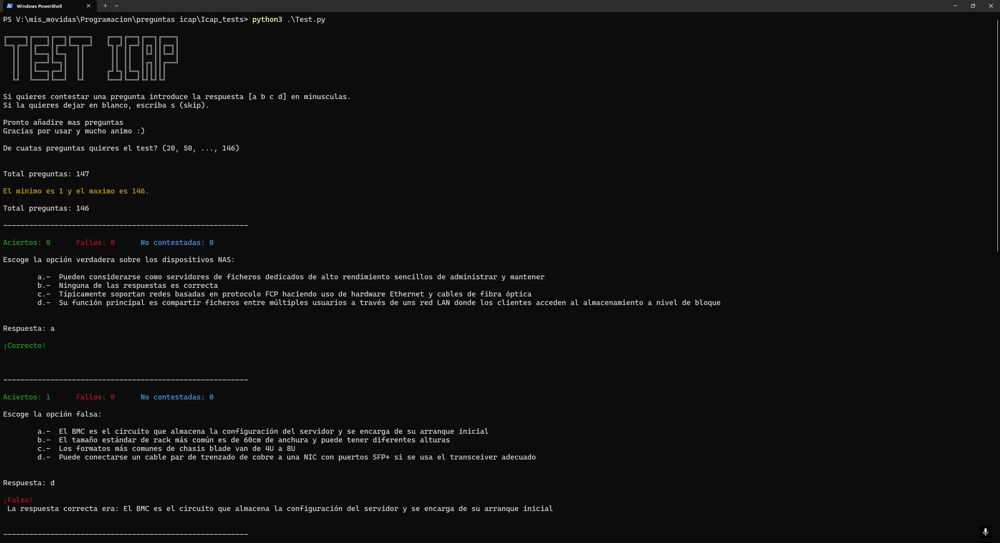

# Icap_tests
Programa con test de repaso de ICAP

Preguntas aleatorias con respuestas en orden aleatorio

Total preguntas: 151

***
**Updates**:

* 5 Nuevas preguntas
* Enumeracion de las preguntas (ahora sabes cuantas preguntas llevas) 
* Indica que preguntas has fallado a lo largo del test
***

## Instrucciones de uso
Descargar el repositorio

En una terminal, situarse en el directorio con los ficheros

Ejecutar: python3 Test.py

Necesitas tener instalada la libreria **colorama**

## Formas de añadir tus propias preguntas
Actualmente, esta hecho de forma que tenga que tener obligatoriamente 4 respuestas.
Debes añadir lineas de 7 en 7 en preguntas.txt siguiendo el formato:

1- Pregunta               ( Se eliminan los 3 primeros caracteres en este caso 1- .)

a. Respuesta 1            ( Para toda respuesta se eliminan las 3 primeros caracteres.

b. Respuesta 2        

c. Respuesta 3

d. Respuesta 4

n                         ( n es la respuesta correcta: {a, b, c, d} tan solo la letra

(Linea en blanco)

----x----

Se puede usar de ejemplo el documento con las preguntas preguntas.txt

